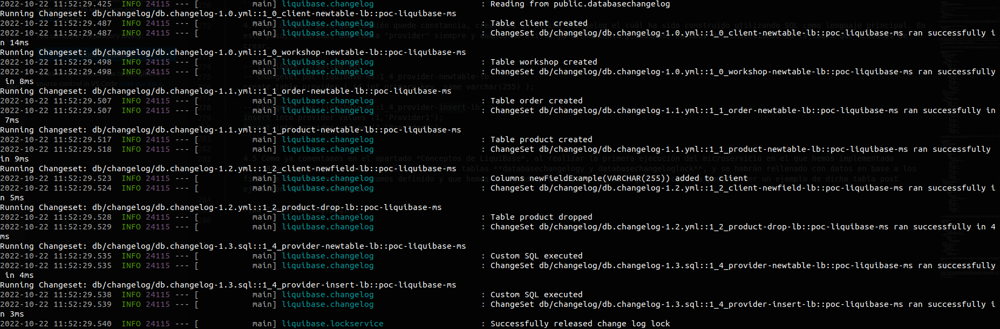
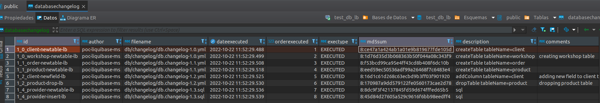

# POC-LIQUIBASE

## ¿Qué es liquibase?

LiquiBase nos proporciona una solución hábil para la gestión de versiones de nuestras bases de datos. Dicha solución se basa principalmente en gobierno de versiones de esquemas de bases de datos a través de nuestros microservicios desarrollados en spring boot. 

Mediante el uso de LiquiBase debemos tener nuestros esquemas de bases de datos definidos a nivel de código en nuestros microservicios basados en Spring Boot, y así poder tenerlos versionados de una manera clara y concisa. Los tipos de archivos que podemos usar para definir estos esquemas y versiones son XML, JSON, YAML, y SQL. En el caso de esta POC, explicaremos como realizar la implantación mediante una definición **basada en archivos YAML, SQL, y XML**.

En este enlace podemos encontrar la documentación completa de LiquiBase https://docs.liquibase.com/home.html

## Conceptos básicos de LiquiBase
LiquiBase funciona de tal manera que, mediante la definición de unos archivos YML, SQL o XML en los cuales indicamos las características del esquema que queremos crear y/o modificar además de otras opciones que podemos encontrar en su documentación oficial.

Una vez hecho esto, Liquibase, al iniciar el microservicio en cuestión, crea las tablas **databasechangelog y databasechangeloglock** cuando se ejecuta en una base de datos por primera vez. Utiliza la tabla **databasechangelog** para realizar un seguimiento del estado de la ejecución de changeSets y **databasechangeloglock** para evitar ejecuciones simultáneas. Con lo que, si se ha ejecutado un changeSet una vez, se registra en la tabla databasechangelog un script que inserta en dicha tabla un registro a modo de log.

- **ChangeSet**: Un changeset es **un conjunto de cambios** que necesitan ser aplicados a la base de datos. 
- **Change**: Un change ejecuta **un único cambio** que será aplicado en nuestra base de datos. Los change types aplicables los puedes encontrar aquí: https://docs.liquibase.com/change-types/home.html
- **ChangeLog**: Es un archivo el cual tiene una **lista o un conjunto de changeSets que necesitan ser aplicados**. 
- **Preconditions**: Las preconditions se implementan dentro de los changeSets y **se usan para definir un estado de la base de datos X para que se aplique un changeSet**.
- **Context**: Un context se aplica a un changeSet y **sirve para determinar si un conjunto de cambios debe ejecutarse en tiempo de ejecución, dado un contexto específico**. 
- **Labels**: El propósito de los labels es similar al de los contextos. La diferencia es que los changeSets se etiquetan con una lista de labels (no expresiones) y, durante el tiempo de ejecución, podemos pasar una expresión de label para elegir los changeSets que coinciden con la expresión

Otro apartado muy a tener en cuenta a la hora de implementar el control de versiones mediante LiquiBase son las **PreConditions** ya que estos serán propiedades que nos ayuden a definir nuestros ficheros e indicarán que condiciones deben cumplirse para ejecutar los changeLogs o no. Estas **Preconditions** es recomendable definirlas en changelogs de tipo YAML, XML y JSON. En changelogs definidos vía SQL no será necesario ya que en la propia sintaxis de SQL podemos indicar las condiciones para que se ejecuten las consultas. Por ejemplo, que se cree una tabla siempre y cuando no esté ya creada *CREATE DATABASE IF NOT EXISTS DBname*. 

Estas pre condiciones que se pueden aplicar se pueden consultar en https://docs.liquibase.com/concepts/changelogs/preconditions.html

Para más información acerca de LiquiBase y sus elementos podemos acudir a: https://docs.liquibase.com/concepts/home.html

## Funcionamiento de esta POC

### Ejemplo práctico de LiquiBase
En este ejemplo práctico vamos a tratar cómo implementar Liquibase en un microservicio de ejemplo. Concretamente, esta implementación la haremos con varios changelogs definidos vía YAML, y otro más definido vía SQL. 

Se incluye un **fichero docker-compose** el cual se encarga de levantar una base de datos en postgres, la cual nos será necesaria para poder ejecutar nuestra POC. *Este docker-compose puede editarse por si, por ejemplo, ya tienes el puerto 5432 en uso y quieres definir otro*. **Para lanzarlo ejecutar *docker-compose up -d* en la misma ruta del propio archivo**.

| :exclamation:  IMPORTANTE         |
|:----------------------------------|
| **Un punto MUY IMPORTANTE que se debe tener en cuenta a la hora de implementar LiquiBase como sistema gestor de versiones de nuestros esquemas es que, los archivos que definen nuestra versión, una vez ejecutados, NO SE DEBEN MODIFICAR. Es decir, si has creado 2 tablas con 3 propiedades en cada una, y necesitas crear un cuarto campo en ellas, SI HAS EJECUTADO ESTA PRIMERA VERSIÓN, ESE CAMBIO DEBE IR EN UN NUEVO ARCHIVO DE VERSIONADO**   |

1. Incluiremos la siguiente dependencia en el POM de nuestro microservicio
    ```
    <!-- pom.xml -->
    <dependency>
        <groupId>org.liquibase</groupId>
        <artifactId>liquibase-core</artifactId>
    </dependency>
    ```
2. Incluímos en nuestro fichero application.yml la configuración necesaria junto con la configuración de JPA.
    ```
    # resources/application.yml
    spring:
    datasource:
        username: user
        password: password
        url: jdbc:postgresql://localhost:5432/test_db_lb
    liquibase:
        enabled: true
    ```

3. En primer lugar tendremos que definir un archivo YAML que hará de "master" y en él, simplemente tendremos que importar vía include los archivos de changeLog que serán los encargados de tener la totalidad del contenido de la definición del versionado de los esquemas de base de datos.

    
    ```
    # resources/db/changelog/db.changelog-master.yaml
    databaseChangeLog:
    - include:
        file: db/changelog/db.changelog-1.0.yml
    - include:
        file: db/changelog/db.changelog-1.1.yml
    - include:
        file: db/changelog/db.changelog-1.2.yml
    - include:
        file: db/changelog/db.changelog-1.3.sql
    ```
4. Implementamos nuestros archivos changeLog, los cuáles serán el núcleo de LiquiBase por así decirlo, y en ellos se encuentra la lógica necesaria para gestionar nuestra base de datos.
Los principales elementos de estos archivos que mostraremos ya están explicados previamente en este documento.

    4.1. Primera versión de nuestro esquema (1.0) de base de datos:
    En este fichero podemos ver cómo creamos dos nuevas tablas en una base de datos que ya teníamos creada previamente en nuestra instancia de base de datos.

    Este archivo lo que hace es en primer lugar comprobar mediante la precondición indicada que, si no existen las tablas que vamos a crear, las cree. Tanto si existen ya las tablas como si no, se guardará en la tabla databasechangelog un registro que indique que el archivo se ha ejecutado.

    ```
    # resources/db/changelog/db.changelog-1.0.yml
    databaseChangeLog:
    - changeSet:
        id: 1_0_client-newtable-lb
        author: poc-liquibase-ms
        preConditions:
            onFail: MARK_RAN
            not:
            tableExists:
                tableName: client
        comments: creating client table
        changes:
            - createTable:
                tableName: client
                columns:
                - column:
                    autoIncrement: true
                    constraints:
                        primaryKey: true
                        primaryKeyName: pk_client
                    name: id
                    type: BIGSERIAL
                - column:
                    name: name
                    type: VARCHAR(50)
                    constraints:
                        nullable: false
                - column:
                    name: address
                    type: VARCHAR(50)
                    constraints:
                        nullable: false
                - column:
                    name: nif
                    type: VARCHAR(50)
                    constraints:
                        nullable: false
    - changeSet:
        id: 1_0_workshop-newtable-lb
        author: poc-liquibase-ms
        preConditions:
            onFail: MARK_RAN
            not:
            tableExists:
                tableName: workshop
        comment: creating workshop table                     
        changes:
            - createTable:
                tableName: workshop
                columns:
                - column:
                    autoIncrement: true
                    constraints:
                        primaryKey: true
                        primaryKeyName: pk_workshop
                    name: id
                    type: BIGSERIAL
                - column:
                    name: name
                    type: VARCHAR(50)
                    constraints:
                        nullable: false
                - column:
                    name: cif
                    type: VARCHAR(50)
                    constraints:
                        nullable: false
                - column:
                    name: address
                    type: VARCHAR(50)
                    constraints:
                        nullable: false
                - column:
                    name: owner
                    type: VARCHAR(50)
                    constraints:
                        nullable: false

    ```
    4.2. En la segunda versión (1.1) que haremos de nuestra base de datos, podemos observar cómo creamos 2 nuevas tablas en nuestro esquema con las mismas precondiciones que indicamos en el archivo anterior.

    ```
    # db.changelog-1.1.yml
    databaseChangeLog:
    - changeSet:
        id: 1_1_order-newtable-lb
        author: poc-liquibase-ms
        preConditions:
            onFail: MARK_RAN
            not: 
            tableExists:
                tableName: Order
        comments: creating order table
        changes:
            - createTable:
                tableName: Order
                columns:
                - column:
                    autoIncrement: true
                    constraints:
                        primaryKey: true
                        primaryKeyName: pk_Order
                    name: id
                    type: BIGSERIAL
                - column:
                    name: name
                    type: VARCHAR(50)
                    constraints:
                        nullable: false
                - column:
                    name: price
                    type: VARCHAR(50)
                    constraints:
                        nullable: false
                - column:
                    name: amount
                    type: NUMERIC
                    constraints:
                        nullable: false                        
    - changeSet:
        id: 1_1_product-newtable-lb
        author: poc-liquibase-ms
        preConditions:
            onFail: MARK_RAN
            not:       
            tableExists:
                tableName: Product
        comments: creating product table
        changes:
            - createTable:
                tableName: Product
                columns:
                - column:
                    autoIncrement: true
                    constraints:
                        primaryKey: true
                        primaryKeyName: pk_Product
                    name: id
                    type: BIGSERIAL
                - column:
                    name: name
                    type: VARCHAR(50)
                    constraints:
                        nullable: false
                - column:
                    name: category
                    type: VARCHAR(50)
                    constraints:
                        nullable: false  
                    
   
    ```
    4.3. En esta versión que hemos denominado 1.2, mostraremos una tercera versión en la cuál añadimos una nueva columna a una tabla ya existente, y a su vez elíminamos una tabla de nuestro esquema. Para que estas órdenes puedan llegar a ejecutarse se deben cumplir las pre condiciones establecidas.

    ```
    # db.changelog-1.2.yml
    databaseChangeLog:
    - changeSet:
        id: 1_2_client-newfield-lb
        author: poc-liquibase-ms
        preConditions:
            onFail: MARK_RAN
            tableExists:
            tableName: client
            not:
            columnExists:
                tableName: client
                columnName: newFieldExample
        comment: adding new field to client table
        changes:
            - addColumn:
                tableName: client
                columns:
                - column:
                    name: newFieldExample
                    type: VARCHAR(255)
    - changeSet:
        id: 1_2_product-drop-lb
        author: poc-liquibase-ms
        preConditions:
            onFail: MARK_RAN
            tableExists:
            tableName: Product  
        comment: dropping product table    
        changes:
            - dropTable:  
                cascadeConstraints: true  
                tableName: Product     
    ```

    4.4 Por último, para que también quede constancia, crearemos un último changelog el cuál ha sido construido utilizando SQL como lenguaje principal. En este paso, crearemos una tabla "provider" siempre y cuando no exista ya dicha tabla y, además, haremos dos inserciones en la tabla que acabamos de crear.
    ```
    -- liquibase formatted sql
    -- changeset poc-liquibase-ms:1_4_provider-newtable-lb
    create table provider ( id int primary key, name varchar(255) );
        
    -- changeset poc-liquibase-ms:1_4_provider-insert-lb
    insert into provider values (1,'Provider1');
    insert into provider values (2,'Provider2');
    ```

    4.5 Iniciamos nuestro servicio. En el caso de esta POC lo hacemos vía terminal.  *mvn spring-boot:run*. Como podemos observar en la siguiente captura, en la traza de log de arranque del servicio podemos observar como los changelogs han sido correctamente ejecutados.

    

    4.5 Como ya comentamos en el apartado *Conceptos de LiquiBase*, al realizar la primera ejecución del microservicio en el que hemos implementado LiquiBase, se habrán creado automáticamente las tablas **databasechangelogy y databasechangeloglock**, y se habrán rellenado con datos en base a los ficheros de versiones que hayamos definido y que hemos comentado previamente. En la siguiente captura podemos ver un ejemplo de dicha tabla post ejecución del microservicio. Además, también se habrán creado las tablas, datos y demás conceptos que hayamos definidos en nuestros changelogs.

    
       